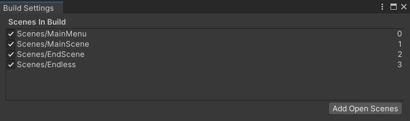

# Important Files to know

| File Name + Directory | Responsibilities |
| --- | --- |
| MatchServer.py | The main matchmaking server that the user first connects to.|
| GameServer.py | The server that the matchmaking server passes the user to, so that the user can operate within only his lobby.|
| Server.py | Prototype of the GameServer with the most basic features of moving the cars over two instances (No Longer In Use)|
| Assets/FirstServerSocketScript.cs | The Client socket that connects to the matchmaking server. |
| Assets/SecondServerSocketScript.cs | The Client socket that connects to the game server after assignment. |

## What to change in these files for you to run

| File Name + Directory | Changes |
| --- | --- |
| GameServer.py | 1- Comment Line 70 for no database writing
| |2- Change the ip in Line 47 to your game server's ip|
| |3- Change the ip in Line 48 to your matchmaking server's ip|
| Assets/FirstServerSocketScript.cs | Change the ip in Line 27 to your matchmaking server's ip|

# How to compile/run

- Install Unity 2021.3.23f1 LTS, and MongoDB on your machines.
- Install pymongo python library using your package manager, e.g pip.

```bash
pip3 install pymongo 
```

- Use Unity to build the game with the following scene build index.


- Run MatchServer.py then GameServer.py using

```bash
python3 MatchServer.py
python3 GameServer.py
```

<em><b>Alternatively, you can run the compiled version attached to directly play online.</b></em>

## [Youtube Demo Video, Press Here](https://youtu.be/hVoL1KevE1g)